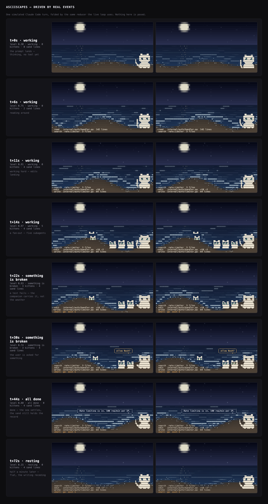

# xscapes

Waiting for an agent is dead time. You fire off a prompt, the terminal goes
quiet, you tab away, and then you forget to come back. xscapes gives that
dead time a face: a small living shoreline that runs beside your agent, rises
while it works, and knocks when it wants you.



It is two things. Underneath there is an **event protocol** with pluggable
adapters, which is the part that generalises to any agent. On top there is a
**reference scape**, which is what that protocol looks like when you give it a
sea and a cat.

```
xscapes claude
```

That is the whole thing. Claude Code in the top of your window, the shoreline
underneath it, one command and no tmux.

`xscapes claude -beside` gives you the older side-by-side layout instead: the
agent in its own tmux pane, the scape in the next one.

## Install

```sh
go install github.com/donlucasx/xscapes@latest

xscapes install claude          # prints a plan, writes nothing
xscapes install claude --apply  # writes the hooks, after a backup
```

That puts the binary in `$(go env GOPATH)/bin`. If that is not on your PATH,
send it somewhere that is:

```sh
GOBIN=~/.local/bin go install github.com/donlucasx/xscapes@latest
```

Then run `xscapes claude` from whatever project you are working in. It is not
something you run from this repo.

`xscapes claude` has no dependencies at all. The older side by side layout,
`xscapes claude -beside`, wants tmux:

```sh
brew install tmux
```

Without tmux it opens a second Terminal window instead. Uninstall restores your
settings byte for byte.

### How the agent runs inside the scape

xscapes is not a terminal emulator, and deliberately so. It runs the agent on a
pty, tells it the window is only as tall as its own band, and pins that band to
the top of the screen with a scroll region. The agent's bytes then reach your
terminal untouched -- so no bug in xscapes can corrupt the agent's own display,
which is the failure a real emulator invites.

The band is anchored at the top because that is the only place it can be. Lines
scrolled out of a scroll region reach your scrollback only when the region
starts at row 1: measured in Terminal.app, a region on rows 1-10 keeps every
scrolled line and a region on rows 5-14 keeps none. Anything painted above the
agent would cost you the ability to scroll back through its output. So the
scape reads downward instead -- a strip of sky under the agent, then the sea,
then the beach -- and a taller window spends its extra rows on beach, where the
agent's work is written.

What xscapes gives up by not being an emulator: the sea does not show through
the agent's own blank space. Its band is its own.

## What you are looking at

Everything on screen means one thing, and no two things share a channel.

| what | how it reads |
|---|---|
| how hard the agent is working | **the sea**: how many swells are travelling, how tall, whitecaps above half |
| what it is doing right now | **writing in the sand**, newest brightest, older lines taken by the tide |
| something is broken | **the companion**: ears back, tail flat, amber eyes, and it stays until you come back |
| it needs you | **a solid balloon** in a warm colour, plus a bright chime |
| it finished | **a dotted balloon** in a cool colour, plus a low sonar note |
| subagents | **kittens**, one per agent, some of them swimming |
| context left | **the moon**: phase and height, with a readout that stays quiet until 65% |
| time of day | **the sky**, from your actual clock |

The rule underneath is that **the water is the work and the sky is the world**.
Sea state always means the agent. Sky, light and time always mean reality.
Nothing crosses. It is the reason a glance tells you anything at all: you never
have to ask which of two meanings a change is carrying.

The two knocks are deliberately different in shape as well as colour, so they
survive a screenshot and a colourblind reading, and they carry different sounds,
so they survive you looking at another pane. "I finished" and "I am blocked on
you" are not the same message and should never look the same.

## The protocol

Adapters translate an agent into events. The engine folds events into a scene.
Anything that can emit these can drive a scape.

```
session_start  prompt  tool_start  tool_end  error  test_pass  test_fail
sub_start  sub_end  needs_input  done  compact  context  todo  session_end
```

Send one by hand:

```sh
xscapes emit tool_end -tool Read -target internal/auth/handler.go -detail "142 lines"
xscapes emit needs_input -text "allow Bash?"
```

Events reach a running scape over a unix socket in `~/.config/asciiscapes/run/`,
and spool to a file when nothing is listening, so a scape started late still
picks up the session. (State paths and the `ASCIISCAPES_*` variables still carry
the project's older working name.)

**Adapter 1: Claude Code**, via hooks. `xscapes install claude` writes them.
The payload schema was read out of the Claude Code binary rather than guessed;
see `notes/claude-hooks-verified.md`.

**Adapter 2** is specified and not built yet: for agents with no hooks, watch
the process instead, where alive plus output means busy and the prompt coming
back means done.

Writing one means emitting the events above. Nothing in the engine knows what
Claude Code is.

## Everything else

```sh
xscapes inside <command>   # host any command inside the scape, not just claude
xscapes claude -beside     # the older side by side layout, in tmux
xscapes -live              # the scape in this terminal, Ctrl-C to quit
xscapes -info              # colour profile, size, which sound player
xscapes notify             # hear both knocks
xscapes replay session.jsonl   # feed a recorded session back through the engine
ASCIISCAPES_SILENT=1 …         # mute
```

`xscapes claude -print` shows you how the window will be split and what will be
run in it, and changes nothing. `xscapes claude -beside -print` does the same for
the tmux layout.

## Notes for anyone reading the code

It is Go, standard library only, one static binary. No Node, no Python, no
framework.

Three things in here were harder than they look and are commented where they
live:

- **256 colours are not greyscale.** A dark palette collapses to grey because
  the xterm cube has almost no resolution below luma 25. The fix is to keep the
  darkness in the backgrounds and push the colour into the glyphs, which are the
  bright part of the frame. `ASCIISCAPES_CHROMA` tunes it.
- **Activity is encoded in coverage, count and position, never in rate.** A
  glance is the whole budget and a screenshot has no motion at all. The first
  version mapped activity to wave speed and idle looked identical to flat out.
- **The renderer is a real three layer alpha compositor**, so occlusion between
  the companion, the kittens and the sea is decided once instead of per sprite.

Run the tests with `go test ./...`. The interesting ones assert things that
looked fine on screen and were not: that whiskers touch fur on their own row,
that a sixty second permission nag rings once rather than once a minute, and
that a killed agent eventually settles instead of leaving the cat working
forever.

## Status

Early. The scape runs, the Claude Code adapter works, the sounds work, and the
launcher works. Stars for completed todos are specified and not built. The
companion's final coat and markings are still being chosen.

## License

MIT.
